# 🔍 Hyperledger Fabric Debugger - Usage Guide

Welcome to the usage guide for the **Hyperledger Fabric Debugger** VSCode extension. This tool is designed to help developers debug chaincode, interact with local Fabric networks, and manage wallets directly from VSCode.

---

## Table of Contents
- [Installation](#installation)
- [Launching the Extension](#launching-the-extension)
- [Using the Extension Features](#using-the-extension-features)
- [Running the Debugger](#running-the-debugger)
- [Example Flow](#example-flow)
- [Troubleshooting](#troubleshooting)
- [Questions or Feedback?](#questions-or-feedback)

---

## ⚙️ Installation

Before using the debugger, ensure the extension is installed using the `vsce` tool.

```bash
npx vsce package
code --install-extension Hyperledger-Fabric-Debugger.vsix
```

## 🚀 Launching the Extension
Open VSCode and navigate to the Run & Debug tab on the sidebar.

Click the "Run Extension" button.
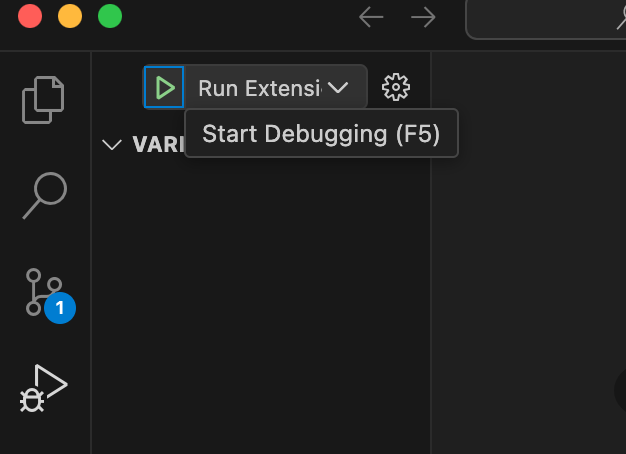

This will open the Extension Development Host, where the debugger's custom UI will appear.
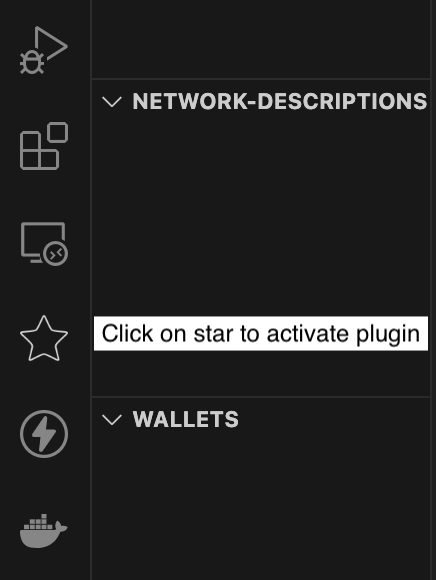

## 🧩 Using the Extension Features
Once the extension UI is open, you’ll see the main dashboard with the following actions:

- **Upload Network Configuration** (e.g., connection profile)  
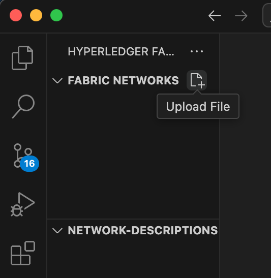

- **Upload Wallet** 
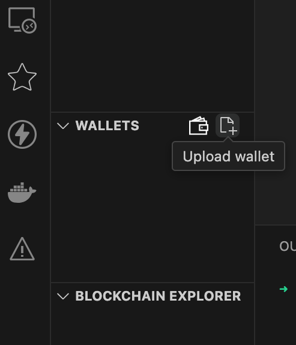

- **Start Local Network** (e.g., using fabric-samples)

- **Query Blocks**
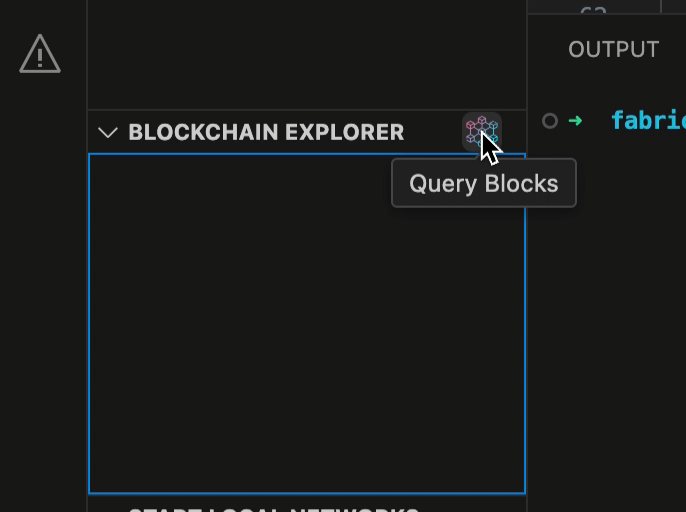

## 🐛 Running the Debugger
To start debugging your chaincode:

1. Click **Run & Debug**.

2. Select the configuration: **Debug Hyperledger Fabric**. 
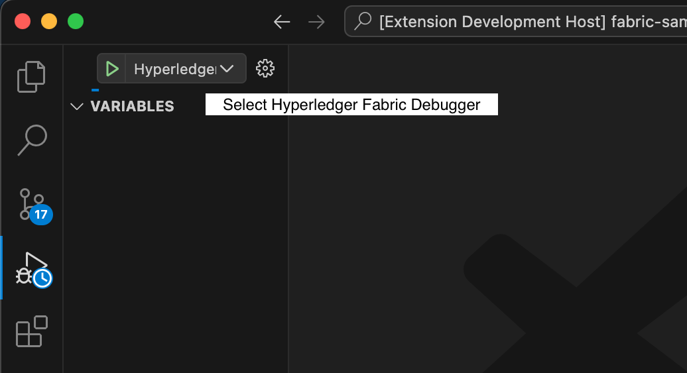

3. A file prompt will appear — select your `chaincode.go` file.
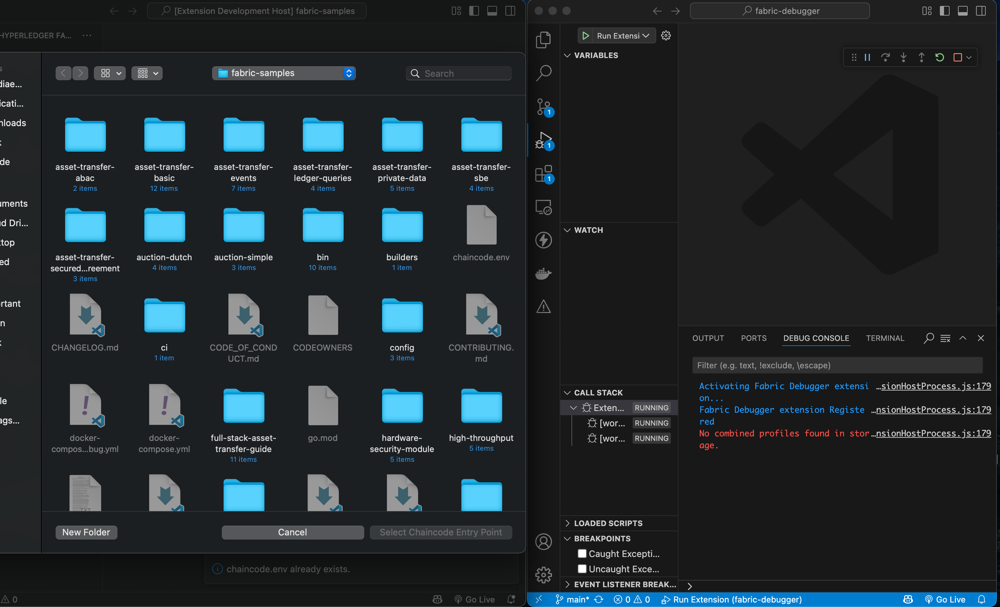

4. The debugger will attach using **Delve**.

5. Set breakpoints in your code.
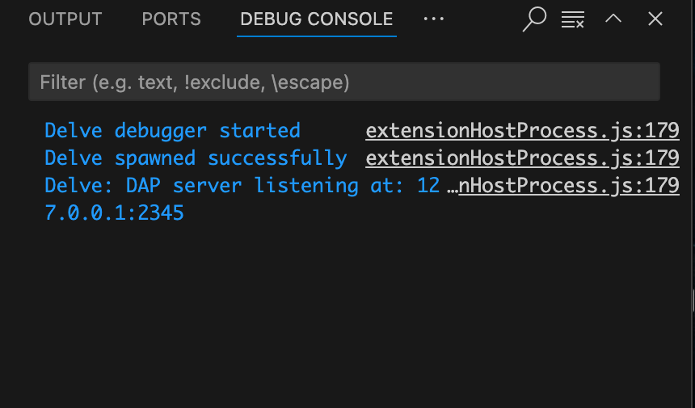

You’ll see the standard VSCode debug interface:

Variables
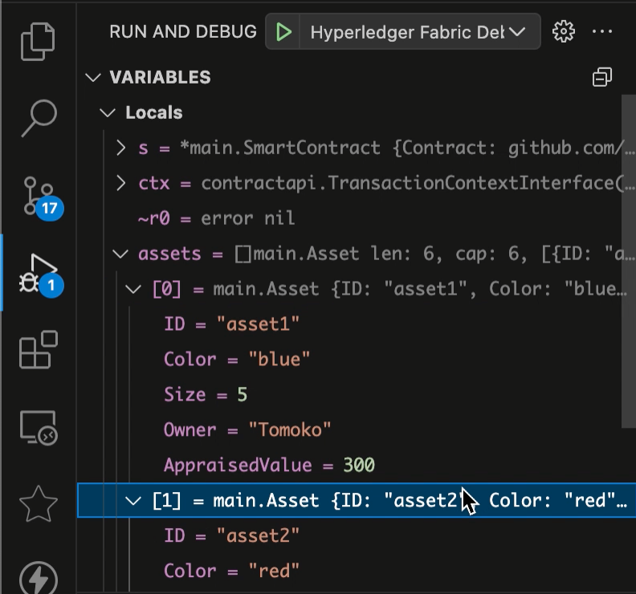

Watch expressions
Call stack
Breakpoints panel
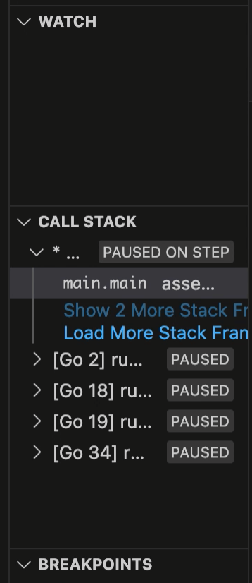

**Debug Console output from Delve**  
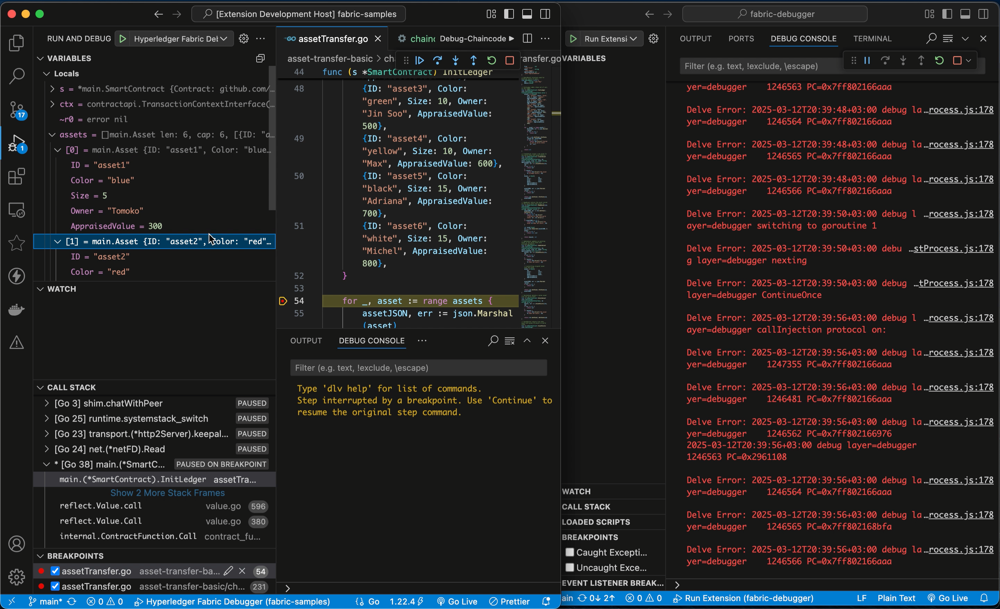

6. Use a Fabric client to invoke chaincode.

## ✅ Example Flow
- Upload network config & wallet.
- Upload your `chaincode.go` file.
- Add breakpoints.
- Use a Fabric client to invoke transactions.
- Observe how the debugger halts at breakpoints, shows local variables, and logs chaincode behavior in real time.

## 🧼 Troubleshooting
If you encounter errors like Delve DAP server not found:

- Ensure `dlv` is installed on your machine:
```bash
 go install github.com/go-delve/delve/cmd/dlv@latest
 
 ```

Restart the extension host and re-select the debug config.

## 🙋 Questions or Feedback?

Found a bug? Have a suggestion?  
Please open an issue or pull request on our [GitHub repository](https://github.com/your-org/your-repo).
